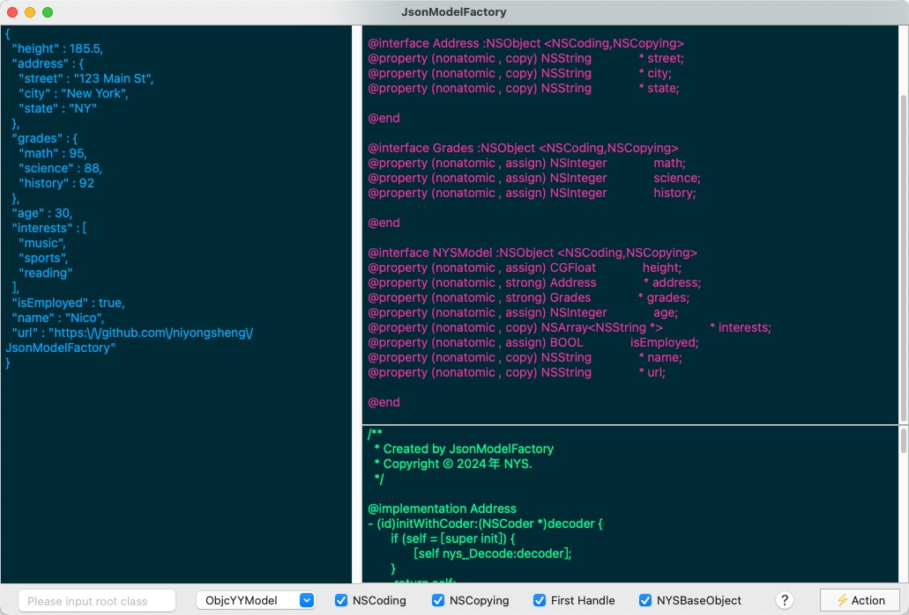

JsonModelFactory
===

===

## Description
> 字典转模型工具。

## Support
- [x] Swift
- [x] Objective-C
- [x] [YYModel](https://github.com/ibireme/YYModel)
- [x] [ExCodable](https://github.com/iwill/ExCodable)

## Screenshot

## Remind
`macOS 12+ `

## Contact Me
* E-mail: niyongsheng@Outlook.com
* Weibo: [@Ni永胜](https://weibo.com/u/7317805089)
